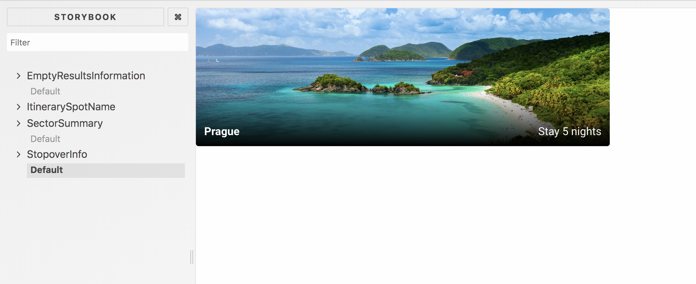
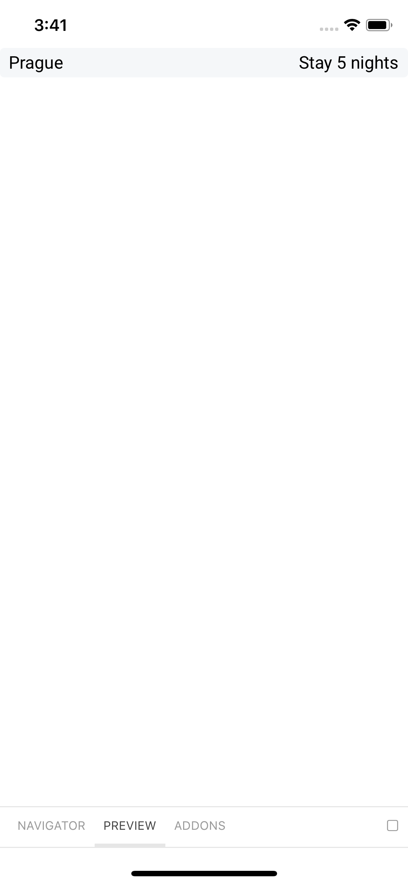

# Step 3

## Using Storybook on mobile and web

**Goal**: Create cross-platform components that have different visual outputs on web and mobile.


Open both mobile and web storybooks (in different terminals):
```
yarn storybook:web
yarn storybook:mobile
```

and customise StopoverInfo component (`packages/components/stopoverInfo)` to match screenshots underneath.

What it should look like on Web:


What it should look like on mobile:



### Image link
The image link is constructed as 
```
https://images.kiwi.com/photos/1200x628/${locationId}.jpg
```
and the `Image` component will come in handy to display it.


### Possible tools:
- `Platform` from `react-native`
- `.web.js`, `.android.js`, `.ios.js`, `.native.js` file extensions
- Custom `StyleSheet` available in `@kiwicom/universal-components`


